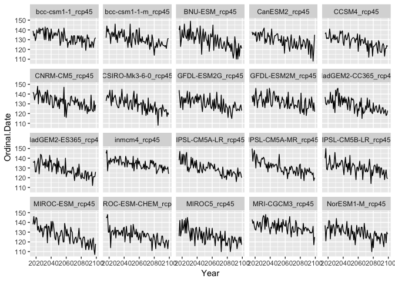
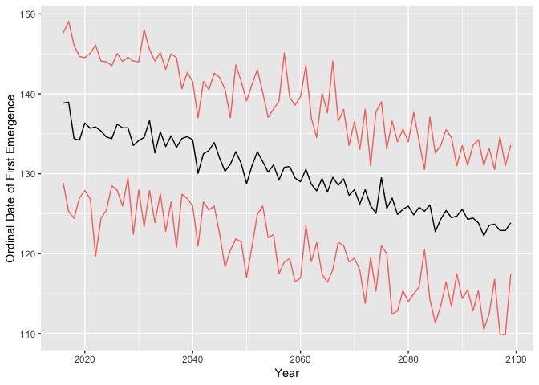
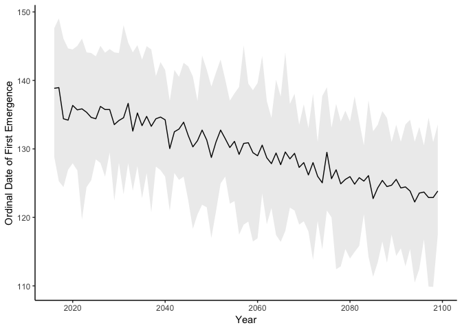

Predicted Butterfly Emergence - Visualization
================
Elsita Kiekebusch
9/11/2019

Extracting First Emergence Date
-------------------------------

Random Forest has predicted daily butterfly presence and absence for 20 General Circulation Models (GCMs) paramaterized by the RCP 8.5 emissions scenario (aka the "business as usual" scenario). These are collected in the file "Output.All.PresenceAbsences.RCP8.5.csv" with each column representing 1 GCM. Here we extract the first date of butterfly emergence for each year.

``` r
setwd('~/Visualizing-Butterfly-Emergence')

allData <- read.csv(file="Output.ALL.PresenceAbsence.RCP8.5.csv")

#get years
emerge <- as.data.frame(unique(allData$Year))
names(emerge)[1] <- "Year"

for (i in 3:22){
  #remove all absence data for each column of interest
  presence <- allData[!(allData[i] == "1:ABSENT"),] 
  ###extracting earliest emergence dates
  calc <- presence %>%
    group_by(Year) %>%
    summarise(early = min(Ordinal))
  emerge <- cbind(emerge,calc$early)
}
```

``` r
#look at the data real quick
str(emerge)
```

    ## 'data.frame':    84 obs. of  21 variables:
    ##  $ Year                : int  2016 2017 2018 2019 2020 2021 2022 2023 2024 2025 ...
    ##  $ bcc-csm1-1_rcp45    : num  139 134 136 129 132 140 137 137 142 136 ...
    ##  $ bcc-csm1-1-m_rcp45  : num  132 144 138 141 136 136 126 136 138 133 ...
    ##  $ BNU-ESM_rcp45       : num  140 144 123 130 140 133 132 146 135 133 ...
    ##  $ CanESM2_rcp45       : num  138 135 137 136 134 138 128 130 137 137 ...
    ##  $ CCSM4_rcp45         : num  136 137 131 132 131 132 141 135 127 131 ...
    ##  $ CNRM-CM5_rcp45      : num  142 140 134 138 140 140 148 130 144 142 ...
    ##  $ CSIRO-Mk3-6-0_rcp45 : num  133 137 139 136 138 144 135 128 144 132 ...
    ##  $ GFDL-ESM2G_rcp45    : num  144 135 126 137 137 124 136 131 136 131 ...
    ##  $ GFDL-ESM2M_rcp45    : num  138 132 139 128 138 146 136 126 134 134 ...
    ##  $ HadGEM2-CC365_rcp45 : num  137 130 129 132 134 130 132 142 131 131 ...
    ##  $ HadGEM2-ES365_rcp45 : num  136 136 137 126 126 132 136 140 124 133 ...
    ##  $ inmcm4_rcp45        : num  145 148 127 136 138 134 140 136 137 139 ...
    ##  $ IPSL-CM5A-LR_rcp45  : num  138 147 134 134 144 134 144 142 133 143 ...
    ##  $ IPSL-CM5A-MR_rcp45  : num  150 137 144 148 140 130 144 140 136 135 ...
    ##  $ IPSL-CM5B-LR_rcp45  : num  140 150 129 128 134 134 143 136 129 128 ...
    ##  $ MIROC-ESM_rcp45     : num  138 146 138 141 145 144 132 136 131 130 ...
    ##  $ MIROC-ESM-CHEM_rcp45: num  145 145 148 130 130 137 114 130 131 132 ...
    ##  $ MIROC5_rcp45        : num  126 142 126 131 143 132 135 142 129 144 ...
    ##  $ MRI-CGCM3_rcp45     : num  143 139 141 136 133 132 137 141 137 135 ...
    ##  $ NorESM1-M_rcp45     : num  137 121 132 135 134 142 141 123 137 129 ...

Visualize the Emergence Dates
-----------------------------

Create a plot for each GCM to have a first look at the data. Generally, (and in accordance with the literature), butterflies are emerging earlier and earlier every year as temperatures rise due to climate change.

``` r
#tidy, multiple plots
emerge %>% tidyr::gather("id", "Ordinal.Date", 2:21) %>% 
  ggplot(., aes(Year, Ordinal.Date))+
  geom_line()+
  #geom_point()+ #makes a point not a line
  #geom_smooth(method = "lm", se=FALSE, color="black")+ #can give you a linear regression line for each panel
  facet_wrap(~id)
```



Mean Emergence
--------------

Calculate the mean emergence date across the 20 GCMs as well as 95% Confidence Intervals, and display the plot. Confidence intervals can be displayed as separate lines (first figure) or as shading (second figure).

``` r
#get mean
emerge$Mean <- NA
emerge$Mean <- rowMeans(emerge[,2:21])

#get quantiles
emerge$Upper <- NA
emerge$Lower <- NA

#formulas
qUp = function(x) quantile(x,0.975)
qLo = function(x) quantile(x,0.025)

#upper and lower 95% confidence intervals for all values
emerge$Upper <- apply(emerge[,2:21],1,qUp)
emerge$Lower <- apply(emerge[,2:21],1,qLo)

#plot
ggplot(emerge, aes(Year, Mean)) +
geom_line() +
geom_line(aes(y = Upper, color = "red")) +             
geom_line(aes(y = Lower, color = "red")) + 
theme(legend.position="none") + 
labs(y="Ordinal Date of First Emergence")
```



``` r
#another way to visualize
ggplot(emerge, aes(Year)) +
  labs(x="Year", y="Ordinal Date of First Emergence") +
  geom_line(aes(y=Mean)) +
  geom_ribbon(aes(ymin = Upper, ymax=Lower), alpha=0.1) +
  theme_classic()
```


